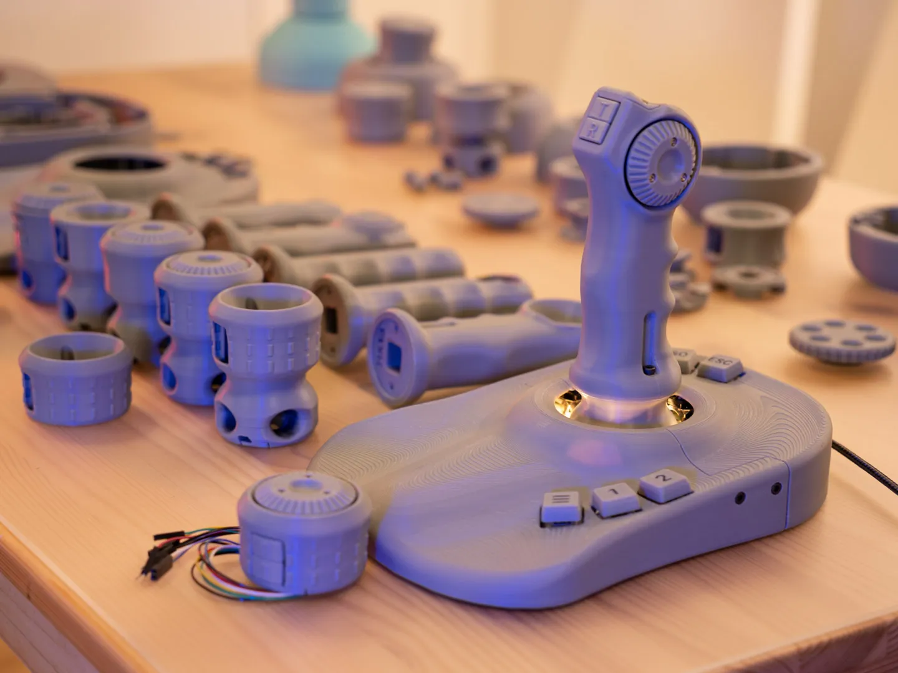

# ErgonoMouse SW

Firmware and a guided local setup experience for the **ErgonoMouse MK XX** 6DOF controller.

ErgonoMouse SW keeps the proven [AndunHH SpaceMouse firmware](https://github.com/AndunHH/spacemouse) at its core and adds an ErgonoMouse-specific path from a finished hardware build to working CAD input. The setup runs locally, stores no data remotely, and replaces manual editing of a large C header for the common configuration.



## Install it — no developer tools

Verified 4.4.0 downloads:

- **Windows x64:** [Setup installer (`.exe`)](https://github.com/JoseLuisGZA/ErgonoMouse_SW/releases/download/ergonomouse-sw-v4.4.0/ErgonoMouse-Setup-4.4.0-windows-x86_64-setup.exe) · [SHA-256](https://github.com/JoseLuisGZA/ErgonoMouse_SW/releases/download/ergonomouse-sw-v4.4.0/ErgonoMouse-Setup-4.4.0-windows-x86_64-setup.exe.sha256)
- **macOS Apple Silicon (M1 or newer):** [DMG](https://github.com/JoseLuisGZA/ErgonoMouse_SW/releases/download/ergonomouse-sw-v4.4.0/ErgonoMouse-Setup-4.4.0-macos-arm64.dmg) · [SHA-256](https://github.com/JoseLuisGZA/ErgonoMouse_SW/releases/download/ergonomouse-sw-v4.4.0/ErgonoMouse-Setup-4.4.0-macos-arm64.dmg.sha256)
- **macOS Intel:** [DMG](https://github.com/JoseLuisGZA/ErgonoMouse_SW/releases/download/ergonomouse-sw-v4.4.0/ErgonoMouse-Setup-4.4.0-macos-x86_64.dmg) · [SHA-256](https://github.com/JoseLuisGZA/ErgonoMouse_SW/releases/download/ergonomouse-sw-v4.4.0/ErgonoMouse-Setup-4.4.0-macos-x86_64.dmg.sha256)
- **Linux x64:** [AppImage](https://github.com/JoseLuisGZA/ErgonoMouse_SW/releases/download/ergonomouse-sw-v4.4.0/ErgonoMouse-Setup-4.4.0-linux-x86_64.AppImage) · [SHA-256](https://github.com/JoseLuisGZA/ErgonoMouse_SW/releases/download/ergonomouse-sw-v4.4.0/ErgonoMouse-Setup-4.4.0-linux-x86_64.AppImage.sha256)
- **Linux x64:** [Portable ZIP](https://github.com/JoseLuisGZA/ErgonoMouse_SW/releases/download/ergonomouse-sw-v4.4.0/ErgonoMouse-Setup-4.4.0-linux-x86_64.zip) · [SHA-256](https://github.com/JoseLuisGZA/ErgonoMouse_SW/releases/download/ergonomouse-sw-v4.4.0/ErgonoMouse-Setup-4.4.0-linux-x86_64.zip.sha256)
- [View all 4.4.0 release files](https://github.com/JoseLuisGZA/ErgonoMouse_SW/releases/tag/ergonomouse-sw-v4.4.0)

1. Download the package for your operating system above.
2. Windows: run the Setup installer. macOS: open the DMG and copy the app to Applications. Linux: open the AppImage.
3. Connect the Pro Micro with a USB **data** cable.
4. Follow six short screens to identify the printed model, choose preferences and install verified firmware.
5. Complete each guided motion check; the app confirms when the controller is ready.

Every native package bundles the setup interface, 84 verified firmware variants and the flashing tool. It does not download a compiler, need an account or send settings anywhere. Packages are not code-signed with a commercial platform certificate or Apple-notarized, so read `UNSIGNED_INSTALL.txt` for the one-time operating-system confirmation and verify the adjacent SHA-256 file when downloading a release.

## Run from source

```bash
./ergonomouse bootstrap
./ergonomouse
```

Open <http://127.0.0.1:8765> if the browser does not open automatically.

The first-run walkthrough will:

1. Welcome the user with a private, account-free five-minute setup;
2. Find the controller automatically and explain USB recovery in plain language;
3. Identify the Free or Complete build through visual, physical questions;
4. Prevent impossible pin combinations without exposing firmware internals;
5. Install the matching verified firmware with a single primary action;
6. Validate centre, travel and all six motions one task at a time;
7. Finish with a concise readiness summary and an optional advanced path.

## Command line

The same workflow is available without the browser:

```bash
./ergonomouse doctor       # inspect local readiness
./ergonomouse bootstrap    # install pinned PlatformIO into .venv
./ergonomouse configure    # generate the default MK XX configuration
./ergonomouse build        # compile
./ergonomouse flash        # compile and upload
```

## Supported physical variants

The configurator is derived from the ErgonoMouse variant matrix and supports:

- Arduino Pro Micro, 5 V / 16 MHz;
- Four resistive joystick modules (eight analog axes);
- Free symmetric Simple base with Simple knob or joystick;
- Complete/custom Simple bases in every orientation, plus six-key bases in left- and right-hand layouts;
- Low-profile knob or tall joystick in symmetric, left- and right-handed layouts;
- Simple, wheel-only, buttons-only and full wheel-plus-buttons controls;
- Controller buttons as rotation/translation locks or additional CAD shortcuts;
- Optional always-on 5 V strip lighting, connected directly to 5 V and GND as published;
- Drift compensation, shaped response and cleaner translation/rotation separation.

The default profile follows the ErgonoMouse wiring exactly: displayed Keys 1–6 use D10, D16, D14, D1, D0 and D15 in that order; the two controller buttons use D5 and D7; and the wheel encoder uses D2 and D3. This lets the fully equipped six-key, two-button and wheel build fit the original Pro Micro.

The firmware automatically centres all eight sensors at startup. The generated limits and dead zone are conservative starting values; the final validation flow exposes the firmware’s live centre, travel and six-axis diagnostics because every printed assembly and joystick set differs slightly.

## Validation and tuning after flashing

The application owns the serial connection and presents only the checks present on the selected build; users do not need to open an IDE serial monitor or remember numeric debug modes. Every physical button is detected and checked individually, wheel builds get a bidirectional encoder check, and precision-button builds explain and verify both movement locks. Holding a precision button suppresses rotation or translation as before; double-clicking that button toggles an extra dominant-axis filter for the remaining motion group, allowing translation or rotation on only one axis at a time. Centre finding updates the running firmware immediately. Runtime tuning can be saved to EEPROM. The travel report remains diagnostic: if it reports a weak or blocked axis, correct the printed mechanism or wiring before changing sensitivity.

## Development

```bash
python3 -m unittest discover -v
./ergonomouse configure
./ergonomouse build
python tools/build_firmware_matrix.py
python tools/package_release.py
python tools/package_native.py
```

`package_release.py` creates the self-contained payload. `package_native.py` wraps that payload in the native installer, AppImage or DMG for the current operating system. GitHub Actions builds and smoke-tests all four target artifacts.

See [docs/ARCHITECTURE.md](docs/ARCHITECTURE.md) for the code layout and [docs/UPSTREAM.md](docs/UPSTREAM.md) for the complete upstream firmware documentation.

## Upstream and license

Firmware history and core implementation are from [AndunHH/spacemouse](https://github.com/AndunHH/spacemouse), with contributions documented in the upstream guide. ErgonoMouse mechanical design is by Jose L. González.

This derivative remains licensed under **Creative Commons Attribution-NonCommercial-ShareAlike 4.0 International**. See [LICENSE](LICENSE).

ErgonoMouse SW is an independent community project and is not affiliated with or endorsed by 3Dconnexion. It simply emulates a compatible USB HID protocol so supported applications can recognize the controller.
